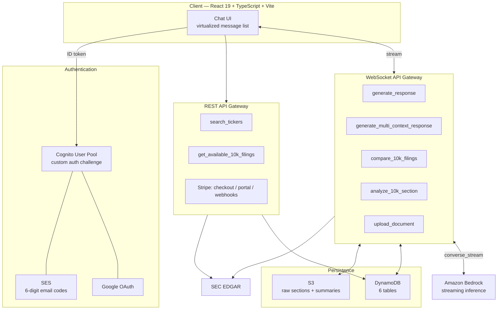

<div align="center">

# FinDiff

**AI-powered analysis of SEC 10-K filings — ask questions, compare years, and surface what actually changed.**

FinDiff pulls annual reports straight from SEC EDGAR, extracts the sections that matter, and puts a streaming LLM in front of them so you can interrogate hundreds of pages of disclosure in seconds instead of an afternoon.

[](https://react.dev)
[](https://www.typescriptlang.org)
[](https://www.python.org)
[](https://aws.amazon.com/lambda/)
[](https://aws.amazon.com/bedrock/)
[](https://www.terraform.io)
[](https://stripe.com)

**[Live app →](https://findiff.com)**

</div>

<!-- TODO: drop a screenshot or 20s GIF of the chat UI here. This is the single highest-impact
     addition to this README — a reviewer should see the product before reading a word of prose.
     Suggested:  -->

---

## The problem

A single 10-K runs 100–300 pages. The interesting information isn't in any one filing — it's in the **delta** between this year's and last year's. Which risk factors are new? How did management's tone in the MD&A shift? What quietly disappeared from the business description?

Finding that by hand means diffing two enormous HTML documents that change their formatting every year. Existing tools either charge institutional prices or just dump the raw text at you.

## The solution

FinDiff automates the whole loop:

1. **Search** any of ~10,000 US public companies by ticker or name
2. **Pick** one or more 10-K filings — FinDiff fetches them live from SEC EDGAR
3. **Ask** anything in natural language, or run a one-click section comparison across years
4. **Read** the answer as it streams in, grounded in the actual filing text

---

## Features

- **Conversational analysis** — multi-turn chat over one or many filings, with history persisted per conversation
- **Year-over-year diffing** — pick a section (Risk Factors, MD&A, Business…) across two filings and get a change summary that skips boilerplate and date churn
- **Section-level deep dives** — targeted value-investor-style summaries of any of the 22 standard 10-K items
- **Automatic section routing** — the model reads your question first and decides which filing sections it needs, so irrelevant text never reaches the analysis prompt
- **Token-by-token streaming** — responses render live over WebSocket instead of a spinner
- **Passwordless auth** — six-digit email codes via SES, plus Google SSO
- **Freemium billing** — anonymous trial, metered free tier, and Stripe-backed premium with entitlements enforced server-side

---

## Architecture

Fully serverless, deployed to AWS entirely through Terraform. Two API surfaces: a REST API for CRUD-shaped calls, and a WebSocket API for anything that streams.



### How a request actually flows

Take *"How did Apple's risk factors change from 2023 to 2024?"*:

1. The client opens a WebSocket and sends the prompt plus the selected filings, attaching the Cognito ID token as a bearer token.
2. The Lambda **verifies the JWT itself** against the Cognito JWKS endpoint — WebSocket routes can't use an API Gateway authorizer, so signature, audience, and issuer are all validated in-process.
3. It reads the `custom:isPremium` claim. Free users get decremented against a per-day DynamoDB counter; when they run out, the socket receives a `free_tier_limit` message and the UI opens the upgrade modal.
4. A cheap Bedrock call reads the question and returns **which 10-K sections are relevant** — usually 1–3 out of 22.
5. For each filing × section, the handler checks S3 for a cached summary. On a hit, it's free and instant. On a miss, it fetches the filing from EDGAR, strips the HTML, regex-locates the section, summarizes it, and writes the result back to S3.
6. Every section of every filing is processed **concurrently** with `asyncio.gather`.
7. The assembled context plus prior conversation turns go to Bedrock via `converse_stream`, and each token is pushed back over the WebSocket as it arrives.
8. Both sides of the exchange are written to DynamoDB so the next turn has history.

---

## Engineering highlights

The parts I'd actually want to talk through in an interview.

### Two-tier caching turns a 60-second cold path into a warm no-op

Summarizing a 10-K section costs real time and real inference dollars, and filings are **immutable once published** — a perfect caching target. Every extracted section and its summary is stored in S3 under a deterministic key derived from CIK, accession number, primary document, and section name. The first user to touch Apple's 2024 Risk Factors pays the cost; everyone after them gets an S3 read.

Filing *lists* are cached separately with a date-stamped TTL, and the cache refresh is fired off as an async `Event`-invocation Lambda so the user's request never waits on it.

### Recursive map-reduce summarization for sections that blow the context window

Some sections — Notes to Financial Statements especially — exceed any usable context window. `summarize_section` handles this by **recursively bisecting** until each chunk fits, summarizing the halves in parallel, then concatenating. Splits carry a 100-character overlap so a sentence straddling the boundary isn't lost. The summarization prompt is deliberately tuned for *near-lossless compression* rather than brevity, because the output is machine input for the next stage, not something a human reads.

### Section extraction that survives real-world filings

There's no schema for a 10-K — every company formats theirs differently. Section boundaries are found by running an ordered table of 22 regex patterns and taking the span between item *n* and the first match of item *n+1*.

The naive version breaks constantly, so the extractor rejects false positives from:
- Table-of-contents entries (the first match is skipped when multiple exist)
- Quoted references — `"Item 1A. Risk Factors"` inside prose
- Cross-references — a 50-character lookback kills matches preceded by *see*, *refer to*, *discussed in*, and friends

Trailing index/quicklinks blocks are trimmed only when TOC markers are actually detected in the document tail, so filings that don't have them aren't truncated.

### Streaming end to end

`bedrock.converse_stream` yields deltas, which are relayed one at a time through the API Gateway Management API to the client's connection ID. On the frontend, chunks land in a `useRef` buffer that's flushed to React state on an interval — this keeps a fast token stream from triggering a re-render per token. The message list is virtualized with `react-virtuoso` so long conversations stay smooth. `GoneException` is caught and swallowed during long jobs so a user closing their tab doesn't kill the work.

### Passwordless auth via Cognito's custom challenge trio

Rather than bolting on a third-party auth service, sign-in is implemented with Cognito's `define` / `create` / `verify` auth-challenge Lambdas: generate a six-digit code, email it through SES from a DKIM-verified domain, verify it, issue tokens. Google OAuth is wired into the same pool as a federated identity provider, so downstream code only ever deals with one token shape.

### Entitlements live in the token, not in application code

A `pre_token_generation` Lambda looks up subscription status in DynamoDB and stamps a `custom:isPremium` claim onto every issued token. Handlers just read the claim — no per-request billing lookup, no way for the client to lie about its tier.

Stripe integration is fully webhook-driven with **signature verification** on all three events (`checkout.session.completed`, subscription ended, subscription canceled), and a `stripe_customers` table maps Stripe customer IDs back to Cognito users.

### Metered free tier with self-cleaning storage

Free usage is tracked in a DynamoDB table keyed on `(user_id, day)` with a TTL set to end-of-day, so expired rows delete themselves at zero cost — no cron, no cleanup job. Decrements go through an atomic `UpdateExpression`, not read-modify-write. Signed-out visitors get a handful of prompts tracked in `localStorage` before the sign-in modal appears.

### Everything is Terraform

All 48 AWS resources — both API Gateways, every Lambda, layers, IAM roles and policies, Cognito, SES with Route 53 DKIM records, S3, and all six DynamoDB tables — are declared as code. Lambdas are defined in a single `for_each` map, so adding a function is a handful of lines rather than a new resource block. Shared dependencies are packaged as versioned Lambda layers to keep individual deployment bundles small.

---

## Tech stack

| Layer | Technologies |
|---|---|
| **Frontend** | React 19, TypeScript, Vite, Tailwind CSS 4, React Router, react-virtuoso, react-markdown |
| **Backend** | Python 3.12, AWS Lambda (22 handlers), 4 shared Lambda layers, `asyncio`, `httpx`, BeautifulSoup |
| **AI** | Amazon Bedrock (`converse` / `converse_stream`), multi-stage prompt pipeline, recursive summarization |
| **APIs** | API Gateway REST + WebSocket, API Gateway Management API for server-push |
| **Data** | DynamoDB (6 tables, TTL + atomic updates), S3 (filing text and summary cache) |
| **Auth** | Cognito User Pools, custom auth challenge Lambdas, Google OAuth, SES, JWT verification via `python-jose` |
| **Payments** | Stripe Checkout, Billing Portal, signature-verified webhooks |
| **Infra** | Terraform, IAM least-privilege roles, Route 53, AWS Amplify (client hosting) |
| **Data source** | SEC EDGAR — live filing fetch, ~10,000 company ticker index |

---

## Repository structure

```
FinDiff/
├── client/                        # React + TypeScript SPA
│   └── src/
│       ├── pages/main/            # Chat UI, sidebar, document selection
│       ├── common/                # Reusable components, hooks, modal system
│       └── service/               # API, WebSocket, Stripe, SEC clients
│
├── server/
│   ├── lambdas/
│   │   ├── compare_10k_filings/           # Year-over-year section diff
│   │   ├── analyze_10k_section/           # Single-section deep dive
│   │   ├── generate_response/             # Single-filing chat
│   │   ├── generate_multi_context_response/  # Multi-filing chat + history
│   │   ├── upload_document/               # Pre-process every section of a filing
│   │   ├── search/                        # Ticker search, filing lookup, cache warmer
│   │   ├── cognito/                       # Passwordless auth + token claims
│   │   ├── stripe/                        # Checkout, portal, webhooks
│   │   └── websocket/                     # Connection lifecycle
│   │
│   ├── layers/
│   │   ├── filings/               # EDGAR fetch, section extraction, summarization
│   │   ├── user_auth/             # JWT verification, CORS helpers
│   │   ├── dynamo/                # DynamoDB helpers, free-tier metering
│   │   └── utils/                 # Shared third-party dependencies
│   │
│   └── deploy.sh                  # Build layers → terraform apply → clean up
│
└── terraform/                     # 48 resources across 9 files
    ├── lambda.tf                  # All Lambdas + layers via for_each
    ├── api_gateway.tf             # REST API, Cognito authorizer, usage plan
    ├── web_socket_api_gateway.tf  # WebSocket routes
    ├── cognito.tf                 # User pool, client, Google IdP
    ├── ses.tf                     # Domain identity, DKIM, Route 53 records
    ├── iam.tf                     # Scoped execution roles
    └── main.tf                    # DynamoDB tables, S3 bucket
```

---

## Running locally

### Frontend

```bash
cd client
npm install
npm run dev          # http://localhost:5173
```

Create `client/.env`:

```bash
VITE_AWS_API_KEY=...        # API Gateway key
VITE_WEBSOCKET_URL=...      # wss://<id>.execute-api.us-east-2.amazonaws.com/prod
VITE_API_URL=...            # REST API base URL
```

`http://localhost:5173` is already registered as a Cognito callback URL, so auth works against the deployed user pool.

### Infrastructure

Requires Terraform ≥ 1.12.2 and an AWS profile named `admin` with Bedrock model access enabled in `us-east-2`.

```bash
cd server
./deploy.sh          # installs layer deps, terraform apply, prunes build artifacts
```

Secrets (Google OAuth, Stripe keys, webhook signing secrets) are supplied via `terraform.tfvars`, which is gitignored. See `terraform/variables.tf` for the full list.

---

## Roadmap

Things I'd tackle next, roughly in priority order:

- **Evaluation harness** — a labeled set of filing/question pairs to catch regressions when prompts or models change. Right now correctness is verified by hand.
- **Automated tests + CI** — unit tests for the section extractor against a corpus of real filings, where the edge cases actually live.
- **Broader filing support** — 10-Qs and 8-Ks reuse most of the pipeline; the section table is the main new work.
- **Citations** — link each claim back to the span of filing text it came from, so answers are auditable.
- **Structured financial extraction** — parse XBRL alongside the narrative to get exact figures instead of model-transcribed ones.
- **Observability** — structured logging and per-request cost tracking; today it's `print` and CloudWatch.

---

## About me

I'm **Conner DeFeo**, a software engineer who likes owning things end to end — from Terraform module to Tailwind class.

I built FinDiff because I invest, and I got tired of the fact that the most valuable signal in an annual report is the part that *changed* — and that finding it meant manually diffing two 300-page documents. So I built the tool I wanted: point it at a company, ask a question in English, get a grounded answer in seconds.

What I ended up learning along the way was mostly not about finance. It was about the unglamorous parts of shipping a real product:

- **Working with LLMs is a systems problem, not a prompting problem.** The interesting work was the pipeline around the model — routing questions to the right sections, recursively compressing text that doesn't fit, caching aggressively because immutable documents should only ever be processed once.
- **Real-world data doesn't have a schema.** Every 10-K is formatted differently. The section extractor is mostly a catalog of ways I found to be wrong: table-of-contents entries, quoted references, cross-references, trailing index blocks.
- **Serverless makes the boring parts sharp.** No API Gateway authorizer on WebSocket routes means verifying JWTs yourself. Streaming means server-push through the Management API. Free-tier metering means atomic DynamoDB updates and TTLs instead of a cleanup job.
- **A side project stops being a side project the moment someone can pay for it.** Webhook signature verification, entitlements in the token rather than in application code, a real domain with DKIM — the last 20% of the work was all of it.

This is a solo project: I designed the architecture, wrote the frontend and the backend, provisioned the infrastructure, and shipped it to production.

I'm currently looking for **<!-- TODO: full-time SWE roles / Summer 2026 internships / etc. -->**, with the most interest in backend, distributed systems, and applied AI.

**[Live app](https://findiff.com)** · **[LinkedIn](<!-- TODO -->)** · **[Email](mailto:ninjanerozz@gmail.com)**
